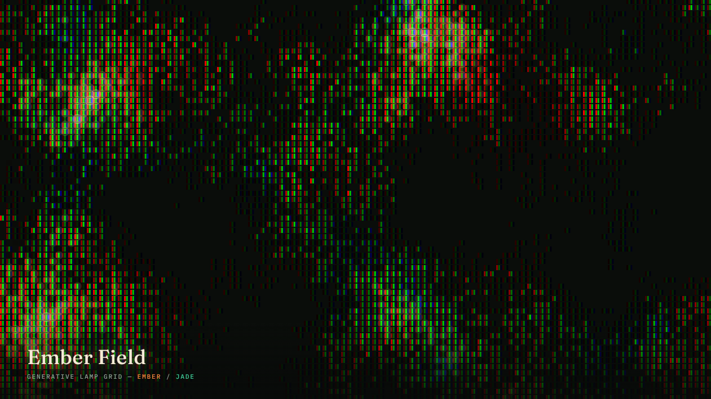

# perlin-canvas

A small, dependency-free animated background: a grid of tiny "lamp" cells
driven by layered Perlin noise, each one snapping between a handful of
brightness steps and picking its color off a hue path. No libraries, no
build step — one `<canvas>` and about 150 lines of vanilla JS.



**[Live demo](https://claude.ai/code/artifact/c28f42b6-981e-4e55-9b0a-cf4b3cecc245)**

## What it's doing

- **Noise field.** A seeded 3D Perlin noise, combined at three octaves
  (`fbm`), drives each cell's brightness over time. A second, independent
  noise field drives each cell's *hue*, so color and brightness drift
  separately instead of moving together.
- **Popcorn twinkle, not a fade.** Each cell gets its own fixed random
  threshold (a cheap integer hash of its grid position), so as the noise
  field sweeps past that threshold, cells snap on individually — a "popcorn"
  effect — rather than the whole field softly pulsing as one sheet.
- **Six brightness steps, seven hue bands.** Both the brightness and hue
  values are quantized before use, so the field reads as distinct lit cells
  in distinct shades, not a smooth gradient wash.
- **RGB subpixel rendering.** Each lit cell is drawn as three vertical
  slivers — pure red, pure green, pure blue — composited with
  `globalCompositeOperation = 'lighter'` (additive blending). Overlapping
  glow pushes toward a warm highlight, and the split channels give the whole
  field a low-res LED/circuit-board texture instead of flat colored squares.
- **Drifting density.** A slow, large-scale noise field modulates how many
  cells are eligible to light up in a given region, so brighter and dimmer
  patches drift across the canvas over time — like embers shifting in a bed
  of coals — rather than one flat, uniform texture.
- **Respects `prefers-reduced-motion`.** If the OS setting is on, the field
  renders one static frame and stops there instead of animating.

## Where this came from

The mechanism (grid of noise-driven cells, additive RGB-subpixel
rendering, per-cell popcorn thresholds) is a recreation of the animated
hero background on [pinloop.ai](https://pinloop.ai/), reverse-engineered
from its shipped source and rebuilt independently — same technique, new
palette (their build runs a blue/violet/orchid hue path; this one runs
ember-orange through gold into jade-green) and a different masking
approach (their version clears text zones for page copy; this one is a
full-bleed, general-purpose background with a slow density drift instead).

## Using it

Everything lives in `main.js` and targets a `<canvas id="field">` — copy
both it and `style.css` into your own page, or lift the script wholesale:

```html
<canvas id="field"></canvas>
<script src="main.js"></script>
```

It sizes itself to the window and redraws on resize, so it works as a
full-page background as-is.

### As a desktop wallpaper

This is a live web page, not a static image, so getting it onto a desktop
takes one extra step:

- Use an HTML-capable wallpaper engine (e.g. [Lively
  Wallpaper](https://www.rocksdanister.com/lively/) on Windows) and point it
  at `index.html` directly, or
- Screen-record a loop, or grab a still frame you like, and use that as a
  conventional static wallpaper.

## Coming soon

Right now the palette, cell size, animation speed, and density are constants
at the top of `main.js`. Next up: pulling those into an options object so
the colors, pacing, and density can be configured without editing the noise
code itself.

## License

MIT — see [LICENSE](LICENSE).
